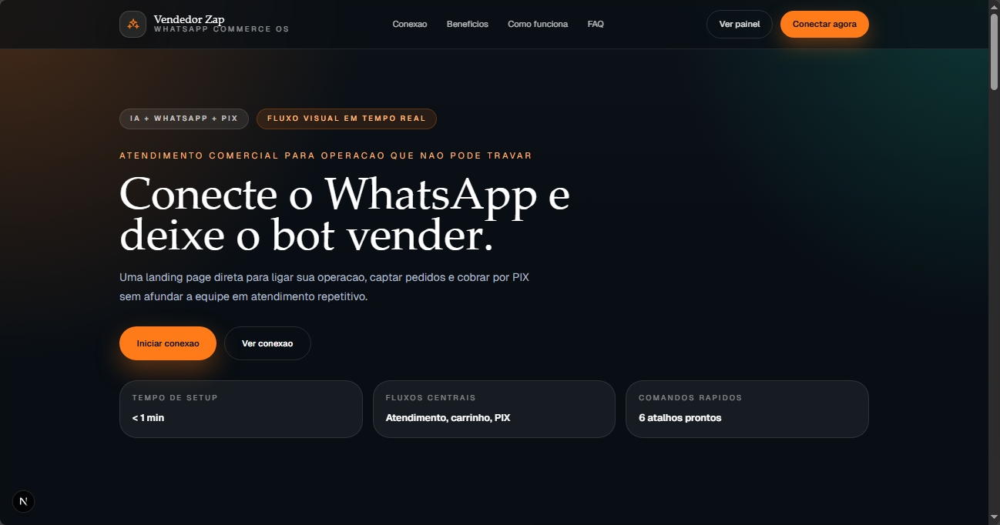

# Vendedor Zap

Agente de IA para vendas no WhatsApp com integracao com Groq, Firebase e AbacatePay.

> Stack: `Next.js` · `React` · `TypeScript` · `Tailwind CSS` · `Baileys` · `Firebase Firestore` · `Groq` · `AbacatePay`



## Funcionalidades

- Conexao com WhatsApp via QR code
- Catalogo de produtos com carrinho
- Atendimento por linguagem natural com Groq
- Geracao de link de pagamento PIX via AbacatePay
- Registro de pedidos no Firebase
- Comandos disponiveis: `/ajuda`, `/produtos`, `/carrinho`, `/historico`, `/frete`, `/reset`

## Tecnologias

- Frontend: Next.js 16, React 19, TypeScript, Tailwind CSS 4
- Backend: API Routes do Next.js, Baileys, Firebase Firestore
- Integracoes: Groq API e AbacatePay

## Como rodar localmente

```bash
git clone https://github.com/SEU_USUARIO/vendedorZap.git
cd vendedorZap
npm install
```

### Configuracao do `.env`

1. Renomeie o arquivo `.env.example` para `.env`.
2. Preencha as chaves obrigatorias do Firebase, Groq e AbacatePay.
3. Ajuste `MY_WHATSAPP_ID` com o numero que podera falar com o bot.
4. Em desenvolvimento, mantenha `NEXTAUTH_URL=http://localhost:3000`.
5. Se publicar em producao, troque `NEXTAUTH_URL` pela URL publica da aplicacao.

Exemplo no Windows PowerShell:

```powershell
Copy-Item .env.example .env
```

Exemplo no macOS/Linux:

```bash
cp .env.example .env
```

O proprio arquivo `.env.example` ja traz um passo a passo curto de onde obter cada chave.
Se quiser um passo a passo mais detalhado para Firebase, Groq e AbacatePay, consulte `GUIA.md`.

## Variaveis de ambiente usadas no projeto

```env
NEXT_PUBLIC_FIREBASE_API_KEY=
NEXT_PUBLIC_FIREBASE_AUTH_DOMAIN=
NEXT_PUBLIC_FIREBASE_PROJECT_ID=
NEXT_PUBLIC_FIREBASE_STORAGE_BUCKET=
NEXT_PUBLIC_FIREBASE_MESSAGING_SENDER_ID=
NEXT_PUBLIC_FIREBASE_APP_ID=
NEXT_PUBLIC_FIREBASE_MEASUREMENT_ID=
GROQ_API_KEY=
ABACATEPAY_API_KEY=
NEXTAUTH_URL=http://localhost:3000
WHATSAPP_VERIFY_TOKEN=
MY_WHATSAPP_ID=
```

### Observacoes importantes

- `NEXT_PUBLIC_FIREBASE_MEASUREMENT_ID` esta no exemplo por completude, mas o codigo atual nao depende dela.
- `WHATSAPP_VERIFY_TOKEN` e opcional neste projeto. Ele so e usado na rota `app/api/webhook/whatsapp/route.ts`.
- `MY_WHATSAPP_ID` restringe quem pode conversar com o bot. Use o numero em formato `5511999999999`.

## Executando

```bash
npm run dev
```

Abra `http://localhost:3000` e clique em `Conectar WhatsApp`.

Depois:

1. Escaneie o QR code com o WhatsApp.
2. Use o numero configurado em `MY_WHATSAPP_ID` para mandar mensagens ao bot.
3. Teste comandos como `/produtos` e `/carrinho`.

## Fluxo principal do projeto

1. A interface web inicia a conexao com o WhatsApp.
2. O Baileys recebe as mensagens.
3. O Groq interpreta a intencao do usuario.
4. O carrinho e os pedidos ficam registrados no Firebase.
5. O checkout gera um link PIX pela AbacatePay.

## Estrutura relevante

```text
app/
├─ app/                         # rotas e UI do Next.js
├─ src/lib/firebase.ts          # configuracao do Firebase
├─ src/lib/whatsapp.ts          # conexao com WhatsApp via Baileys
├─ src/lib/abacatepay.ts        # integracao de pagamentos
├─ src/services/groqService.ts  # interpretacao com IA
└─ src/services/messageHandler.ts
```

## GitHub e seguranca

- O arquivo `.env` nao deve ser versionado.
- O `.env.example` pode ser commitado e usado como modelo.
- A pasta `whatsapp_auth/` tambem deve permanecer fora do Git, pois guarda a sessao local do WhatsApp.

## Testes e validacao

O projeto nao possui testes automatizados no momento. Para validar:

1. Rode `npm run lint`.
2. Rode `npm run dev`.
3. Conecte o WhatsApp e envie mensagens usando o numero permitido.
4. Gere um link de pagamento e confira o retorno da AbacatePay.

## Autor

Gabriel Passos
